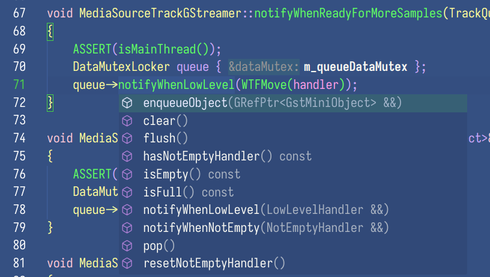
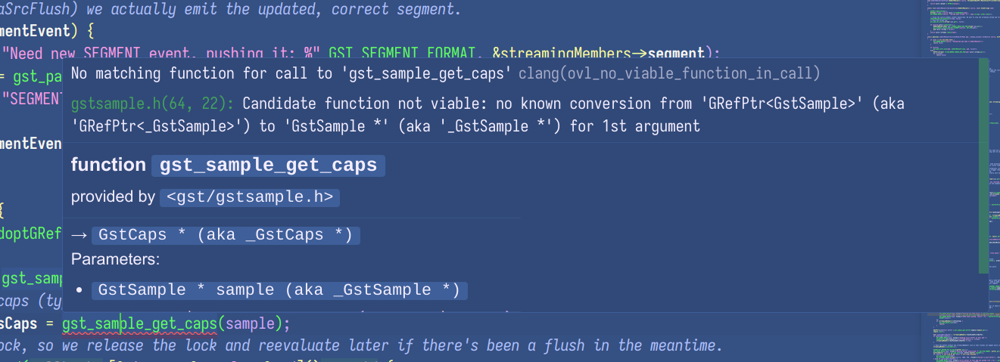
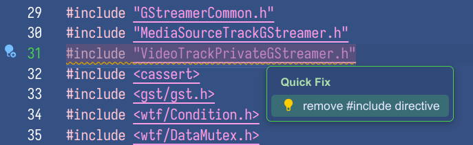
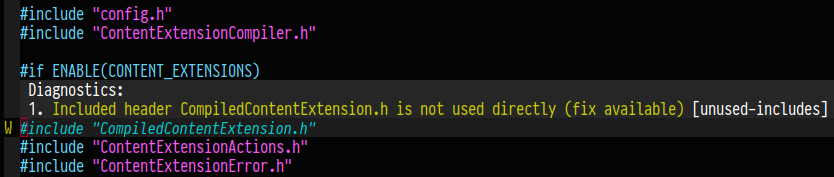

<!-- .slide: data-cover -->

<h1 id="presentation-title">clangd in WebKit: a last minute update</h1>
<h5 id="presentation-author">Alicia Boya García</h5>
<h5 id="presentation-date">WebKit Contributors Meeting 2024</h5>

---

# tl;dr

### PSA: clangd is awesome, try it!

---

#### Want to have fast autocompletion?

##### Go to definition?

##### Find usages?

##### *Compiler errors as you type the code!?*

#### *Coding C++ like it's no longer the 80s!!!!?*

---

#### Now you can!

### Yes, YOU!

---

#### clangd is a code indexer for C and C++

It uses ___the same parser___ as the clang compiler, making it **very accurate**!

Even more impressive, it is capable of providing reasonably fast autocompletion ***even for WebKit*** (!!)

Analyzing a .cpp file takes a couple seconds on load and then it's nearly instantaneous!

---



---



---

# OS support

clangd is **part of the LLVM tree**

All major operating systems where clang works, clangd should work:

**Linux, macOS, even Windows!** 🤯

---

# Editor support

clangd uses the Language Server Protocol:

https://microsoft.github.io/language-server-protocol/

---

#### Chances are your editor is supported and you don't even know it!

https://microsoft.github.io/language-server-protocol/implementors/tools/

VS Code, (Neo)Vim, emacs, Kate, VisualStudio, SublimeText...

**Notable exception: Xcode doesn't support LSP 🙁**

---

#### WebKit build system support

**Both are supported.**

cmake: for every platform

Xcode: for macOS

---

#### Reference setup (Linux)

For Linux developers, if you:

 * Use the reference [WebKit container SDK](https://github.com/Igalia/webkit-container-sdk)
 * Use VSCode *inside* the container
 * Compile with either stock clang or stock gcc

It is already preinstalled and **should work out of the box** once you build WebKit!

If not, it is a bug. Report it. You can tag me.

---

#### Reference setup (macOS)

A few steps required

https://trac.webkit.org/wiki/Clangd#macOS1

```bash
make release EXPORT_COMPILE_COMMANDS=YES
generate-compile-commands WebKitBuild/Release
```

If it doesn't work, it is a bug. Report it.

---

#### Other setups

Expect to have to tinker, but I promise it is worth it

---

### New! clangd auto-setup infrastructure in WebKit

*Useful defaults so more people join the future!*

Triggers automatically when you build

---

### New! clangd auto-setup infrastructure in WebKit

* Generates `.clangd` configuration file
    * Auto-magically adapted for your OS!
    * Auto-updates!
    * ... but if you write your own `.clangd` file, it will respect it

---

### New! clangd auto-setup in WebKit

* (Relevant only for CMake) Updates `compile_commands.json` to point to a valid file
    * Defaults to typical paths inside `WebKitBuild/`
    * Edit `update-compile-commands-symlink.conf` in the repo root if you don't like where it points to for whatever reason
    * Auto-updates too
    * if you write your own, it will also respects your changes

---

### Troubleshooting

```bash
clangd --enable-config --check=your_source_file.cpp
```

A bit outdated but people still find it useful for troubleshooting: https://blogs.igalia.com/aboya/2021/10/02/setting-up-visualstudio-code-to-work-with-webkitgtk-using-clangd/

---

### Common annoyance

##### clangd adds includes automatically

Unfortunately, this is currently a bit clunky in WebKit

You can disable it passing `--header-insertion=never` to clangd

---

#### Another reason to keep non-unified builds working

If a .cpp file would have an include error when built without unified builds, it will have an include error in clangd

**Please keep good include hygiene!**

---

#### New! clangd-18 highlights unused includes!





---

### Good luck, and join me coding like it's the late 90s!
